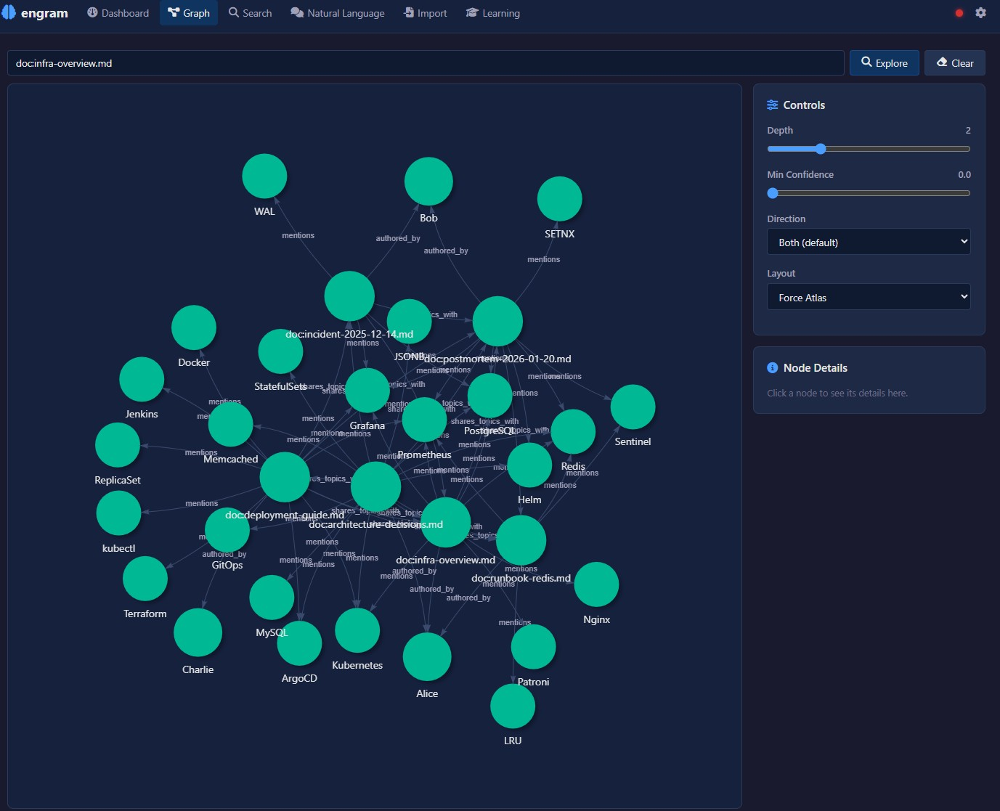

# Engram

**AI Memory Engine** -- knowledge graph + semantic search + reasoning + learning in a single binary.



---

## What is Engram?

Engram is a high-performance knowledge graph engine built as persistent memory for AI systems. It combines graph storage, semantic search, logical reasoning, and continuous learning into a single binary with a single `.brain` file.

- **Single binary** -- no runtime dependencies, no Docker, no cloud
- **Single file** -- one `.brain` file is your entire knowledge base. Copy = backup, move = migrate
- **No external database** -- everything is built in
- **Hybrid search** -- BM25 full-text + HNSW vector similarity + bitmap filtering
- **Confidence lifecycle** -- knowledge strengthens with confirmation, weakens with time, corrects on contradiction
- **Inference engine** -- forward/backward chaining, rule evaluation, transitive reasoning
- **Ingest pipeline** -- NER (GLiNER2 ONNX), entity resolution, conflict detection, PDF/HTML/table extraction
- **Multi-agent debate** -- 7 analysis modes with War Room live dashboard and 3-layer synthesis
- **Chat system** -- 47 tools across 8 clusters (analysis, investigation, reporting, temporal, assessment)
- **Assessment engine** -- Bayesian confidence with living assessments and evidence boards
- **Temporal facts** -- valid_from / valid_to on edges with automatic extraction
- **Contradiction detection** -- automatic conflict detection with resolution workflows
- **Knowledge mesh** -- peer-to-peer sync with ed25519 identity and trust scoring
- **Built-in web UI** -- Leptos WASM frontend with graph visualization, onboarding wizard, and SSE live updates
- **Multiple APIs** -- HTTP REST (230+ endpoints), MCP, gRPC, A2A, LLM tool-calling

---

## Two Ways to Use Engram

Engram works in two complementary modes. Both use the same binary and the same `.brain` file.

### <i class="fa-solid fa-terminal"></i> Backend Engine (API / CLI)

Use engram as a headless knowledge graph engine. Store nodes, create edges, run queries, push inference rules, and ingest data -- all through CLI commands, HTTP REST, MCP, gRPC, A2A, or LLM tool-calling.

This is the **integration path**: embed engram into AI agents, automation pipelines, or existing applications. No browser needed.

```bash
engram create my.brain
engram store "Berlin" my.brain
engram relate "Berlin" "capital_of" "Germany" my.brain
engram serve my.brain
```

After starting the server, run through the **onboarding wizard** via API to configure your LLM, embedder, and NER providers. See the [Configuration wiki](https://github.com/dx111ge/engram/wiki/Configuration) for the API-based setup flow.

### <i class="fa-solid fa-desktop"></i> Interactive Playground (Web UI)

Start the server and open `http://localhost:3030` in your browser. Four sections:

- **Knowledge** -- graph explorer, search, documents, facts, chat
- **Insights** -- intelligence gaps, assessments, contradictions
- **Debate** -- multi-agent analysis with 7 modes and a live War Room
- **System** -- configuration, NER/RE settings, sources, domain taxonomy

On first launch with an empty brain, the **onboarding wizard** guides you through 11 setup steps.

---

## Quick Start

### 1. Download

Download the latest binary **and the `frontend/` folder** from [Releases](https://github.com/dx111ge/engram/releases).

Available for: **Windows** (x86_64), **Linux** (x86_64, aarch64), **macOS** (aarch64).

Place the `frontend/` folder next to the binary:
```
engram.exe            (or engram on Linux/macOS)
frontend/
  index.html
  engram-ui-*.js
  engram-ui-*_bg.wasm
  graph-bridge.js
  style-*.css
```

The web UI is served automatically when the frontend folder is detected.

### 2. Create and populate

```bash
engram create my.brain
engram store "PostgreSQL" my.brain
engram store "Redis" my.brain
engram relate "PostgreSQL" "caches_with" "Redis" my.brain
```

### 3. Start the server

```bash
engram serve my.brain
# HTTP API: http://localhost:3030
# Web UI:   http://localhost:3030
```

### 4. Configure (recommended: Gemma 4)

We recommend **Gemma 4** as the LLM (thinking mode, large context window). Run it locally with [Ollama](https://ollama.com/):

```bash
ollama pull gemma4:e4b
```

Then configure engram via the web UI onboarding wizard, or via API:

```bash
curl -X POST http://localhost:3030/config \
  -H "Content-Type: application/json" \
  -d '{"llm_endpoint": "http://localhost:11434/v1/chat/completions", "llm_model": "gemma4:e4b"}'

curl -X POST http://localhost:3030/config/wizard-complete
```

Any OpenAI-compatible LLM endpoint works (Ollama, vLLM, OpenAI, Azure, etc.).

---

## CLI Reference

| Command | Description |
|---------|-------------|
| `engram create [path]` | Create a new `.brain` file |
| `engram store <label> [path]` | Store a node |
| `engram relate <from> <rel> <to> [path]` | Create a relationship |
| `engram query <label> [depth] [path]` | Query and traverse edges |
| `engram search <query> [path]` | Search (BM25, filters, boolean) |
| `engram serve [path] [addr]` | Start HTTP + gRPC server |
| `engram mcp [path]` | Start MCP server (stdio) |
| `engram reindex [path]` | Re-embed all nodes after model change |
| `engram stats [path]` | Show node and edge counts |
| `engram delete <label> [path]` | Soft-delete a node |

---

## Documentation

Full documentation is available on the [GitHub Wiki](https://github.com/dx111ge/engram/wiki):

| Page | Description |
|------|-------------|
| [Getting Started](https://github.com/dx111ge/engram/wiki/Getting-Started) | Download, install, first brain, quick start for both modes |
| [Configuration](https://github.com/dx111ge/engram/wiki/Configuration) | Onboarding wizard, LLM setup, embeddings, SearXNG, API-based config |
| [HTTP API](https://github.com/dx111ge/engram/wiki/HTTP-API) | Full REST API reference (230+ endpoints) |
| [MCP Server](https://github.com/dx111ge/engram/wiki/MCP-Server) | MCP tools for Claude, Cursor, Windsurf (24 tools) |
| [Python Integration](https://github.com/dx111ge/engram/wiki/Python-Integration) | EngramClient, bulk import, LangChain, auth, debate, chat |
| [Architecture](https://github.com/dx111ge/engram/wiki/Architecture) | System design, layers, storage engine, compute |
| [Integrations](https://github.com/dx111ge/engram/wiki/Integrations) | MCP, A2A, gRPC, SSE, webhooks, web search providers |
| [Use Cases](https://github.com/dx111ge/engram/wiki/Use-Cases) | 13 end-to-end walkthroughs with Python demos |

---

## Use Cases

| # | Use Case | Description |
|---|----------|-------------|
| 1 | [Wikipedia Import](docs/usecases/01-wikipedia-import/) | Build a knowledge graph from Wikipedia summaries |
| 2 | [Document Import](docs/usecases/02-document-import/) | Ingest markdown/text with metadata and entity extraction |
| 3 | [Inference & Reasoning](docs/usecases/03-inference-reasoning/) | Vulnerability propagation and SLA mismatch detection |
| 4 | [Support Knowledge Base](docs/usecases/04-support-knowledge-base/) | IT support error/cause/solution graphs |
| 5 | [Threat Intelligence](docs/usecases/05-threat-intelligence/) | Threat actor, malware, CVE, and TTP graphs |
| 6 | [Learning Lifecycle](docs/usecases/06-learning-lifecycle/) | Full lifecycle: store, reinforce, correct, decay, archive |
| 7 | [OSINT](docs/usecases/07-osint/) | Open Source Intelligence with multi-source correlation |
| 8 | [Fact Checker](docs/usecases/08-fact-checker/) | Multi-source claim verification |
| 9 | [Web Search Import](docs/usecases/09-web-search-import/) | Progressive knowledge building from web search |
| 10 | [NER Entity Extraction](docs/usecases/10-ner-entity-extraction/) | spaCy NER pipeline for entity extraction |
| 11 | [Semantic Web](docs/usecases/11-semantic-web/) | JSON-LD import/export for linked data |
| 12 | [Codebase Understanding](docs/usecases/12-codebase-understanding/) | AST analysis for codebase knowledge graphs |
| 13 | [Intel Analyst](https://github.com/dx111ge/intel-analyst) | OSINT intelligence dashboard with real-time ingest and gap detection |

---

## Built with Engram

| Project | Description |
|---------|-------------|
| [Intel Analyst](https://github.com/dx111ge/intel-analyst) | OSINT intelligence dashboard powered by engram's knowledge graph, ingest pipeline, and gap detection engine |

---

## License

Engram is free for personal use, research, education, and non-profit organizations.

Commercial use requires a paid license. Contact **sven.andreas@gmail.com** for commercial licensing.

See [LICENSE](LICENSE) for full terms.
