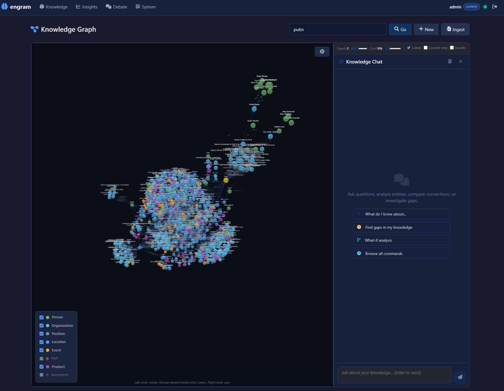
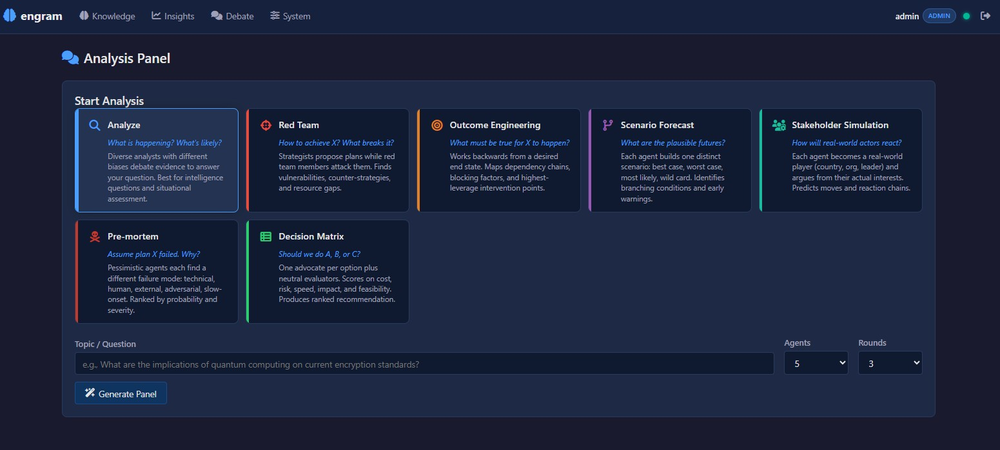

# Engram v1.1.2

**AI Intelligence Platform** -- knowledge graph + semantic search + reasoning + learning in a single binary.





---

## What is Engram?

Engram is a self-hosted AI knowledge engine that combines graph storage, semantic search, logical reasoning, and continuous learning into a single Rust binary with a single `.brain` file. No cloud, no external dependencies.

- **Single binary** -- no runtime dependencies, no Docker, no cloud
- **Single file** -- one `.brain` file is your entire knowledge base. Copy = backup, move = migrate
- **No external database** -- custom mmap storage, everything built in
- **Hybrid search** -- BM25 full-text + HNSW vector similarity + bitmap filtering
- **Confidence lifecycle** -- knowledge strengthens with confirmation, weakens with time, corrects on contradiction
- **Inference engine** -- forward/backward chaining, rule evaluation, transitive reasoning
- **Ingest pipeline** -- NER (GLiNER2 ONNX, GPU-accelerated), entity resolution, conflict detection, PDF/HTML/table extraction
- **Multi-agent debate** -- 7 analysis modes with War Room live dashboard and 3-layer synthesis
- **Chat system** -- 47 tools across 8 clusters (analysis, investigation, reporting, temporal, assessment)
- **Assessment engine** -- Bayesian confidence with living assessments and evidence boards
- **Temporal facts** -- valid_from / valid_to on edges with automatic extraction
- **Contradiction detection** -- automatic conflict detection with resolution workflows
- **Knowledge mesh** -- peer-to-peer sync with ed25519 identity and trust scoring
- **Built-in web UI** -- Leptos WASM frontend with 3D graph visualization, onboarding wizard, and SSE live updates
- **Multiple APIs** -- HTTP REST (230+ endpoints), MCP, gRPC, A2A, LLM tool-calling

---

## Who is Engram for?

**As a backend memory layer** -- integrate Engram into your AI pipeline via REST, MCP, or gRPC. Use the onboarding wizard once, then run headless.

**As an intelligence workbench** -- ingest documents, build knowledge graphs, run multi-agent debate, assess with Bayesian confidence. Full web UI with interactive 3D graph, chat, and War Room.

---

## Quick Start

### 1. Download

Download the latest release from [Releases](https://github.com/dx111ge/engram/releases/tag/v1.1.2).

| Platform | Download |
|----------|----------|
| Windows x86_64 | `engram-windows-x86_64.zip` |
| Linux x86_64 | `engram-linux-x86_64.zip` |
| Linux aarch64 | `engram-linux-aarch64.zip` |
| macOS aarch64 | `engram-macos-aarch64.zip` |

Unzip and run. The web UI frontend is bundled inside the zip.

### 2. Start

```bash
engram serve my.brain
# HTTP API + Web UI: http://localhost:3030
```

### 3. Configure

Open `http://localhost:3030` -- the onboarding wizard guides you through setup.

We recommend **Gemma 4** as the LLM. Run it locally with [Ollama](https://ollama.com/):

```bash
ollama pull gemma4:e4b
```

Any OpenAI-compatible LLM endpoint works (Ollama, vLLM, OpenAI, Azure, etc.).

---

## Web UI

Four sections accessible after login:

- **Knowledge** -- interactive 3D graph explorer, entity search, Knowledge Chat with 47 tools
- **Insights** -- knowledge stats, contradictions, documents, intelligence gaps
- **Debate** -- 7 AI analysis modes: Analyze, Red Team, Outcome Engineering, Scenario Forecast, Stakeholder Simulation, Pre-mortem, Decision Matrix
- **System** -- hardware, embeddings, NER, LLM config, web search providers, ingestion sources, domain taxonomy

---

## CLI Reference

| Command | Description |
|---------|-------------|
| `engram create [path]` | Create a new `.brain` file |
| `engram store <label> [path]` | Store a node |
| `engram relate <from> <rel> <to> [path]` | Create a relationship |
| `engram query <label> [depth] [path]` | Query and traverse edges |
| `engram search <query> [path]` | Search (BM25, filters, boolean) |
| `engram serve [path] [addr]` | Start HTTP + gRPC server |
| `engram mcp [path]` | Start MCP server (stdio) |
| `engram reindex [path]` | Re-embed all nodes after model change |
| `engram stats [path]` | Show node and edge counts |
| `engram delete <label> [path]` | Soft-delete a node |

---

## Documentation

| Page | Description |
|------|-------------|
| [Getting Started](https://github.com/dx111ge/engram/wiki/Getting-Started) | Download, install, first brain, quick start |
| [Configuration](https://github.com/dx111ge/engram/wiki/Configuration) | Onboarding wizard, LLM setup, embeddings, SearXNG |
| [HTTP API](https://github.com/dx111ge/engram/wiki/HTTP-API) | Full REST API reference (230+ endpoints) |
| [MCP Server](https://github.com/dx111ge/engram/wiki/MCP-Server) | MCP tools for Claude, Cursor, Windsurf (24 tools) |
| [Python Integration](https://github.com/dx111ge/engram/wiki/Python-Integration) | EngramClient, bulk import, LangChain, auth, debate, chat |
| [SearxNG Setup](docs/searxng-setup.md) | Self-hosted web search: installation, engines, rate limits |
| [Architecture](https://github.com/dx111ge/engram/wiki/Architecture) | System design, layers, storage engine, compute |
| [Use Cases](https://github.com/dx111ge/engram/wiki/Use-Cases) | 13 end-to-end walkthroughs with Python demos |

---

## Use Cases

| # | Use Case | Description |
|---|----------|-------------|
| 1 | [Wikipedia Import](docs/usecases/01-wikipedia-import/) | Build a knowledge graph from Wikipedia summaries |
| 2 | [Document Import](docs/usecases/02-document-import/) | Ingest markdown/text with metadata and entity extraction |
| 3 | [Inference & Reasoning](docs/usecases/03-inference-reasoning/) | Vulnerability propagation and SLA mismatch detection |
| 4 | [Support Knowledge Base](docs/usecases/04-support-knowledge-base/) | IT support error/cause/solution graphs |
| 5 | [Threat Intelligence](docs/usecases/05-threat-intelligence/) | Threat actor, malware, CVE, and TTP graphs |
| 6 | [Learning Lifecycle](docs/usecases/06-learning-lifecycle/) | Full lifecycle: store, reinforce, correct, decay, archive |
| 7 | [OSINT](docs/usecases/07-osint/) | Open Source Intelligence with multi-source correlation |
| 8 | [Fact Checker](docs/usecases/08-fact-checker/) | Multi-source claim verification |
| 9 | [Web Search Import](docs/usecases/09-web-search-import/) | Progressive knowledge building from web search |
| 10 | [NER Entity Extraction](docs/usecases/10-ner-entity-extraction/) | spaCy NER pipeline for entity extraction |
| 11 | [Semantic Web](docs/usecases/11-semantic-web/) | JSON-LD import/export for linked data |
| 12 | [Codebase Understanding](docs/usecases/12-codebase-understanding/) | AST analysis for codebase knowledge graphs |
| 13 | [Intel Analyst](https://github.com/dx111ge/intel-analyst) | OSINT intelligence dashboard with real-time ingest and gap detection |

---

## Built with Engram

| Project | Description |
|---------|-------------|
| [Intel Analyst](https://github.com/dx111ge/intel-analyst) | OSINT intelligence dashboard powered by engram's knowledge graph, ingest pipeline, and gap detection engine |

---

## License

Engram is free for personal use, research, education, and non-profit organizations.

Commercial use requires a paid license. Contact **sven.andreas@gmail.com** for commercial licensing.

See [LICENSE](LICENSE) for full terms.
